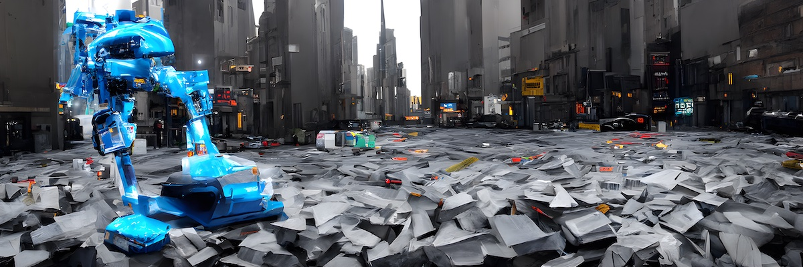

# MLfix – using AI and UI to explore and fix datasets


[](https://gitter.im/MLfix/community?utm_source=badge&utm_medium=badge&utm_campaign=pr-badge&utm_content=badge)

This repository contains tools which can help you find mistakes in your labels. It helps if you have some image dataset (for example an object detection dataset with bounding boxes) and you:

1. want to make sure the objects are assigned to the correct class and bounding boxes are drawn
2. wish to explore it and discover the different variations occuring in the data

The tools work by sorting the images by visual similarity and then showing them in a streamlined user interface. The interface allows you to mark the photos so you can perform the QA process. The visual similarity sorting is based on a model trained in an unsupervised manner so it's not limited to ImageNet-like data.

We are still working on the documentation and examples (it will be comming in a few weeks). In the mean time you can check the presentation we did at [OSS NA 2022](OSS%20NA%%20presentation.pdf).


Is your dataset overflowing with low quality samples? Our highly-skilled robots can help you! (generated by [Centipede Diffusion](https://github.com/Zalring/Centipede_Diffusion/) based on an image prompt composed manually from two other generated images)

## How to use

This library contains command line tools to process the image. Right now it's easiest to start with any dataset in the ImageNet format (one folder per class) or with just a folder of unsorted pictures. For example if you download [the DeepFashion2 dataset](https://github.com/switchablenorms/DeepFashion2) you can run the following commands:


```
git clone https://github.com/collabora/MLfix.git
cd MLfix
pip install -e .
qa_backend_downsize_images ./deepfashion2 ./deepfashion2-256
qa_backend_pretrain --pretrained ./deepfashion2-256  # trains a model (starting from ImageNet weights)
                                                     # and generates the BoVW features
qa_backend_sort_images ./deepfashion2-256            # creates a JSON with all images sorted by similarity
```

Afterwards you can go run `python -m http.server` and go to the URL:
`http://localhost:8000/mlfix-ui/#../deepfashion2-256/barlow-twins-resnet18-pretrained-224-5e-proj2048-lr0.5e-3-sample-1024vw.json` to load the MLfix web app.
